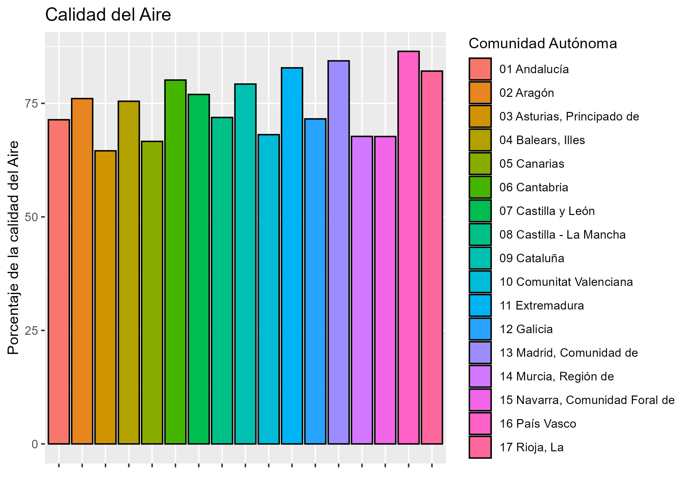

# Relación entre Alzheimer y Calidad del Aire y Zonas Verdes

## Integrantes:
- Manuel Sánchez Paredes (msp1030@alu.ubu.es)
- Santiago Herrero Ruipérez (shr1006@alu.ubu.es)

## Introducción

El Alzheimer es una enfermedad neurodegenerativa de la que no se conoce con certeza sus orígenes y causas. Este trabajo busca explorar la posible relación entre factores ambientales como las zonas verdes o la calidad del aire con esta enfermdedad.

## Objetivo General

El objetivo general de este trabajo es analizar si la baja calidad del aire y la escasez de zonas verdes en el entorno influye en la presencia de Alzheimer.

